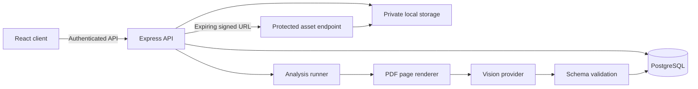

# Planly

Planly is an AI-assisted architectural drawing review workspace. It accepts PDF drawing sets, renders individual sheets, runs evidence-oriented review modes, places findings on the drawing, and lets a human reviewer acknowledge, resolve, or dismiss each finding.

The long-term product direction is **Architectural Intelligence**: a project-aware system that understands drawing sets, specifications, revisions, decisions, and downstream construction outcomes—not merely a chatbot attached to PDFs.

> Planly supports professional review; it does not replace an architect, engineer, code consultant, or authority having jurisdiction. AI findings must be verified by a qualified person.

## Current capabilities

- Email/password authentication with short-lived access tokens.
- Hashed, rotating, server-revocable refresh sessions.
- Project and drawing management.
- PDF signature validation and a 20 MB upload limit.
- Page-by-page drawing rendering and vision analysis.
- Five review modes:
  - Submission readiness
  - Documentation review
  - Constructability review
  - Coordination review
  - Compliance-risk review
- Strict validation of structured AI responses.
- Evidence locations rendered as drawing overlays.
- Versioned analysis runs with provider, model, prompt, duration, attempt, and error metadata.
- Relational findings with open, acknowledged, resolved, and dismissed states.
- PostgreSQL-backed recovery of interrupted runs without BullMQ or Redis.
- In-process concurrency control for a single API instance.
- Expiring signed URLs for private PDFs and rendered pages.
- API, authentication, upload, daily-analysis, and analysis-trigger limits.
- Request IDs and structured error logs.

The researched product strategy and implementation backlog live in [Architectural Intelligence Product Brief](docs/ARCHITECTURAL_INTELLIGENCE_PRODUCT_BRIEF.md).

## Technology

| Layer | Technology |
| --- | --- |
| Web client | React 19, React Router, Vite |
| API | Node.js, Express 5 |
| Database | PostgreSQL, Prisma |
| Authentication | JWT access tokens, rotating refresh sessions, bcrypt |
| AI | OpenAI-compatible providers: OpenAI or OpenRouter |
| PDF processing | pdf2pic with `pdftoppm` fallback |
| Validation | Zod |
| Tests | Node.js test runner, ESLint, Vite production build |

## Architecture



Analysis runs are persisted before execution. The API process recovers `PENDING` and `PROCESSING` runs after restart and processes at most two concurrently. This is appropriate for a single-instance deployment. Multi-instance production deployment should use distributed run claiming or a managed durable job system.

## Repository structure

```text
Planly/
├── backend/
│   ├── prisma/                 Database schema and migrations
│   ├── src/
│   │   ├── config/             Environment and database configuration
│   │   ├── controllers/        HTTP request handling
│   │   ├── middlewares/        Authentication, uploads, limits, errors
│   │   ├── prompts/            Versioned review instructions
│   │   ├── routes/             Express routes
│   │   ├── services/           Domain, AI, storage, and analysis logic
│   │   └── utils/              Tokens, cookies, signed assets, errors
│   ├── test/                   Backend tests
│   └── uploads/                Local development assets; not source data
├── client/
│   └── src/
│       ├── api/                Feature API calls
│       ├── components/         UI and drawing-review components
│       ├── context/            Authentication state
│       ├── hooks/              Reusable client behavior
│       ├── pages/              Routed screens
│       └── services/           HTTP and application services
└── docs/                       Product and engineering context
```

## Prerequisites

- Node.js 20.19 or newer; Node.js 22 LTS is recommended.
- npm.
- PostgreSQL.
- Poppler (`pdftoppm`) or GraphicsMagick/ImageMagick for PDF rendering.
- An OpenAI or OpenRouter API key.

On Ubuntu/Debian, the PDF fallback can be installed with:

```bash
sudo apt-get install poppler-utils
```

## Local setup

### 1. Clone and install dependencies

```bash
git clone https://github.com/adityaapraveen/Planly.git
cd Planly

cd backend
npm install

cd ../client
npm install
```

### 2. Configure the backend

```bash
cd backend
cp .env.example .env
```

Fill in the PostgreSQL URL, JWT secrets, provider, model, and matching provider API key.

Generate the Prisma client and apply migrations:

```bash
npx prisma generate
npx prisma migrate deploy
```

For development migrations, use `npm run prisma:migrate` instead of `migrate deploy`.

### 3. Configure the client

```bash
cd ../client
cp .env.example .env
```

### 4. Start the applications

Backend:

```bash
cd backend
npm run dev
```

Client, in a second terminal:

```bash
cd client
npm run dev
```

Open `http://localhost:5173`.

## Environment variables

Backend variables are documented in [backend/.env.example](backend/.env.example).

Important operational settings:

| Variable | Purpose | Default |
| --- | --- | --- |
| `AI_REQUEST_TIMEOUT_MS` | Per-provider request timeout | `120000` |
| `AI_MAX_RETRIES` | Provider SDK retries | `0` |
| `AI_PROMPT_VERSION` | Stored with each analysis run | `v1` |
| `ANALYSIS_DAILY_LIMIT` | Maximum new runs per user per UTC day | `25` |
| `ASSET_URL_TTL_SECONDS` | Signed drawing URL lifetime | `900` |

## API overview

All project and analysis routes require a bearer access token unless noted.

| Method | Route | Purpose |
| --- | --- | --- |
| `POST` | `/api/auth/register` | Create an account and refresh session |
| `POST` | `/api/auth/login` | Sign in |
| `POST` | `/api/auth/refresh` | Rotate the refresh session |
| `POST` | `/api/auth/logout` | Revoke the current refresh session |
| `GET` | `/api/auth/me` | Return the current user |
| `GET/POST` | `/api/projects` | List or create projects |
| `GET/PATCH/DELETE` | `/api/projects/:projectId` | Manage a project |
| `GET/POST` | `/api/projects/:projectId/drawings` | List or upload drawings |
| `DELETE` | `/api/projects/:projectId/drawings/:drawingId` | Delete a drawing and its assets |
| `POST` | `/api/drawings/:drawingId/analyze` | Start or rerun a review mode |
| `GET` | `/api/drawings/:drawingId/analysis` | Get the latest run for a mode |
| `GET` | `/api/drawings/:drawingId/report` | Get drawing, pages, and signed URLs |
| `PATCH` | `/api/analysis/issues/:issueId` | Update human review status |
| `GET` | `/api/assets/...` | Read an asset using an expiring signature |
| `GET` | `/api/v1/health` | Health check; public |

To force a new versioned run:

```json
{
  "reviewMode": "COORDINATION_REVIEW",
  "force": true
}
```

## Analysis lifecycle

1. The API verifies drawing ownership and daily usage.
2. An `Analysis` run is persisted as `PENDING`.
3. The local runner starts the run when a concurrency slot is available.
4. The PDF is split into reusable rendered pages.
5. Each page is reviewed using the selected mode.
6. The model response must satisfy the structured contract.
7. Findings are normalized and persisted as relational `AnalysisIssue` records.
8. The run becomes `COMPLETED` or `FAILED` with diagnostic metadata.
9. The client polls only while the selected run is pending or processing.
10. A reviewer confirms, resolves, or dismisses each finding.

Malformed model output fails the run. It is never silently converted into a successful report with no findings.

## Security model

- Passwords are hashed with bcrypt.
- Access tokens remain in client memory.
- Refresh tokens are stored in `httpOnly` cookies.
- Only SHA-256 refresh-token hashes are stored in PostgreSQL.
- Refresh sessions rotate on every successful refresh and can be revoked.
- Drawing records are ownership-scoped.
- PDFs are checked by MIME type and `%PDF-` signature.
- Raw storage directories are not publicly mounted.
- PDFs and page images are served through HMAC-signed, expiring URLs.
- API and expensive endpoints have independent rate limits.
- AI output is untrusted input and validated before persistence.

## Validation

Backend:

```bash
cd backend
npm test
npx prisma validate
npx prisma migrate status
npm audit --omit=dev
```

Client:

```bash
cd client
npm run lint
npm run build
```

## Current production boundaries

- Local storage is private but not shared across instances. Move to S3-compatible object storage before horizontal scaling.
- The persisted runner recovers restarts but does not coordinate multiple API instances. Add atomic run claiming or a managed job service before scaling out.
- Compliance-risk review is advisory. Jurisdiction-specific sources and citations are required before representing results as code compliance.
- There is no organization, invitation, or role model yet.
- There is no subscription billing or metered plan enforcement yet.
- Full provider and browser end-to-end test suites remain to be implemented.
- AI-generated findings require professional review and sign-off.

## Product direction

The next valuable loop is:

> Upload a drawing set → understand its sheets and references → find evidence-backed risks → let a professional decide → upload a revision → prove what was fixed and what regressed.

See [docs/ARCHITECTURAL_INTELLIGENCE_PRODUCT_BRIEF.md](docs/ARCHITECTURAL_INTELLIGENCE_PRODUCT_BRIEF.md) for research, competitive analysis, differentiated opportunities, AI architecture, metrics, and the prioritized roadmap.
